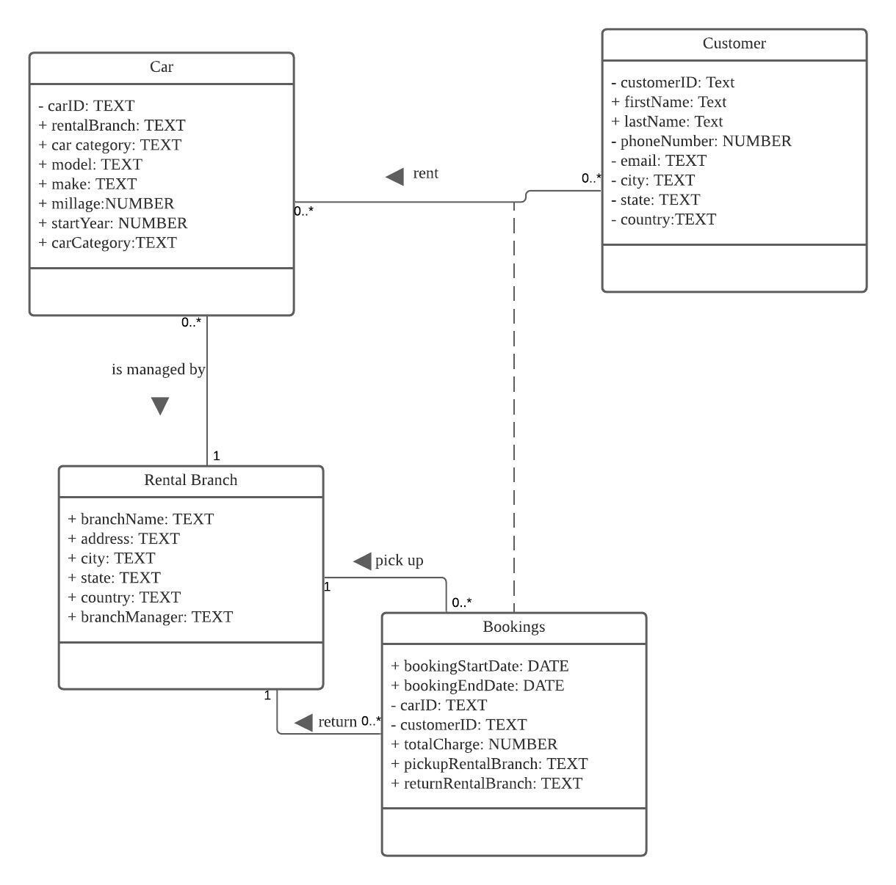

# Building an management system for a car rental company
## Purpose Statement
We aim to develop a web-based management system for a car rental company. It has two main functionalities: 
1. Facilitate the rental company to manage their car fleet. For example: the rental company can add a new car to their fleet, update a car's rental price and other information, or delete an existing car from the fleet. 
2. Provide a powerful tool for the rental company to monitor their business activities in all aspects. For example: the system can display all the cars owned by the rental company, fleets at different locations, amount of transactions per month, number of customers etc. By closely monitoring their business data, the rental company can adjust business strategies based on performance as well as gain a better understanding of their customers in order to promote the quality of service. 

## How to run the program
1. clone the project to your local using git clone.
2. cd into project directory.
3. run npm install command to install all necessary packages.
4. run npm start command.
5. open your browser and navigate to localhost:3000/ and you should see the "Car Management" page.

## UML Diagram
https://lucid.app/lucidchart/722ed355-65d1-47df-9cc8-3ba5faa57deb/edit?beaconFlowId=341BAFE5E164E51C&invitationId=inv_6ba983b6-83d2-4e74-866d-5fbff519bbd8&page=0_0#

## ERD Diagram
https://lucid.app/lucidchart/4cc47107-7d20-475b-9944-03504518d9ac/edit?page=0_0&invitationId=inv_9cbd9f0a-f83d-4c95-931b-c6932ece15a2#

## Business requirement 
Please see file: Project_docs/businessRequirement.pdf

## SQL data definition statements 
Please see file Project_docs/CreateTableSQL/createTable.sql.

Screen shots of we successfully create tables:

## How we populated the database using test data
Please see other files under the folder "Project_docs/CreateTableSQL", which include the commands we used to populate the database.

## 5 queries we wrote for the database
Please see the file "project_queries.sql"  
Screenshots of the run results of these 5 queries  
  
query 1    

  
query 2  

  
query 3  

  
query 4  

  
query 5  

## Database schemas and proof that they are in BCNF:

Database schemas:

Car(**carID**, *currentRentalBranchID, carCategoryID, modelID, makeID,* startYear, mileage, isAvailable)  
Customer(**customerID**, firstName, lastName, phoneNumber, email, city, state, country)  
Booking(**bookingID**, bookingStartDate, bookingEndDate, *carID, customerID,* totalCharge, pickupRentalBranchID, returnRentalBranchID)  
RentalBranch(**rentalBranchID**, branchName, address, city, state, country, branchManager)  
Car Category(**categoryID**, categoryType)  
Car Model(**modelID**, model)  
Car Make(**makeID**, make)

Proof that our schemas are in BCNF:

1.All the schemas are in 1NF because all the attributes in all schemas are single-valued.
2.To prove the schema is in 2NF and BCNF, list out all the functional dependencies in each schema:
    
    Car:
    carID -> currentRentalBranchID
    carID -> carCategoryID
    carID -> modelID
    carID -> makeID
    carID -> startYear
    carID -> mileage
    carID -> isavailable
    
There’s only one primary key in this table. All the attributes in the Car schema are only and fully dependent on the primary key alone. Therefore this schema is in 2NF and BCNF. 

    Customer:
    customerID -> firstName
    customerID -> lastName
    customerID -> phoneNumber
    customerID -> email
    customerID -> city
    customerID -> state
    customerID -> country
    
There’s only one primary key in this table. All the attributes in the Customer schema are only and fully dependent on the primary key alone. Therefore this schema is in 2NF and BCNF.
    
    Booking:
    bookingID -> bookingStartDate
    bookingID -> bookingEndDate
    bookingID -> carID
    bookingID -> customerID
    bookingID -> totalCharge
    bookingID -> pickupRentalBranchID
    bookingID -> returnRentalBranchID
    
There’s only one primary key in this table. All the attributes in the Booking schema are only and fully dependent on the primary key alone. Therefore this schema is in 2NF and BCNF.

    RentalBranch:
    rentalBranchID -> branchName
    rentalBranchID -> address
    rentalBranchID -> city
    rentalBranchID -> state
    rentalBranchID -> country
    rentalBranchID -> branchManager

There’s only one primary key in this table. All the attributes in the RentalBranch schema are only and fully dependent on the primary key alone. Therefore this schema is in 2NF and BCNF.

    Car Category:
    categoryID -> categoryType
    
    Car Model:
    modelID -> model

    Car Make:
    makeID -> make
    
There’s only one primary key in these tables. All the attributes in these three schemas are only and fully dependent on their respective primary key alone. Therefore, these schemas are in 2NF and BCNF. 

## Team contributions
We splitted our tasks evenly during this assignment. We conducted zoom meetings/online chat/Lucid Chart to put together the business requirement documents, UML and ERD diagrams and BCNF analysis.  
For creating tables, Bugu wrote the queries and April QA'ed for her.  
For creating testing data and populating the database, April created the test data online and Bugu performed the population.  
For creating the 5 SQL queries, April wrote the queries and Bugu QA'ed for her.  
We set up the Github repo together and both worked on uploading files into the repo as well as the write-up for this README.md file

In terms of project implementation, the work is splitted as below:  
  
@Bugu Wu implemented:
1. CRUD operations of Rental Branch  
2. Implemented rental branch search:  
   a. Filter top K rental ranches based on their transaction amount   
4. Implemented booking analysis:  
   a. Filter bookings by start/end date  
   b. Filter bookings by car make/category
         
@April Zhang implemented:
1. CRUD operations of Car  
2. Implemented car search functionalities:  
   a. Filter cars by service start year  
   b. Filter cars that belong to a certain make and model  
3. Implemented Customer analysis:  
   a. calculate customers' membership titles based on their total transaction amount (>$3000 gold membership, >$2000 silver membership, >$1000 bronze membership).  
   b. search and display customers that have booked with the company for more than certain times.
